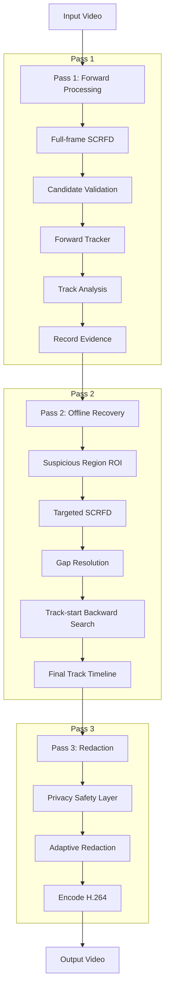
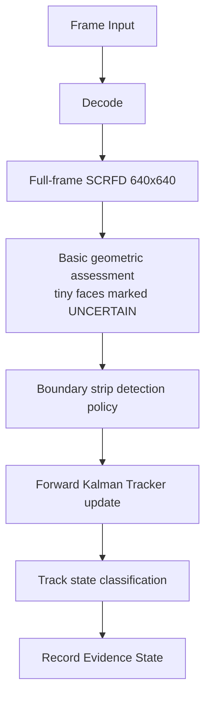
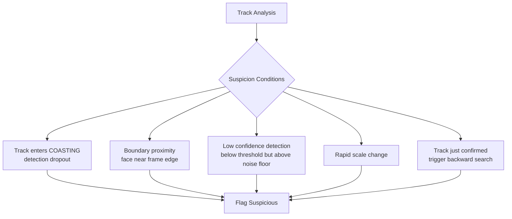
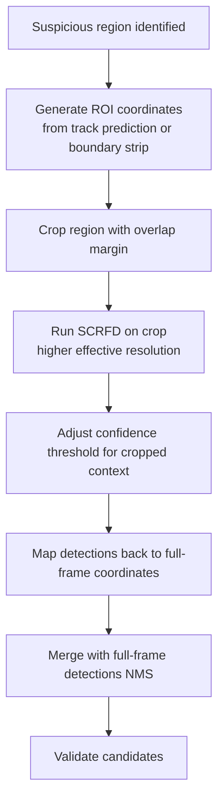
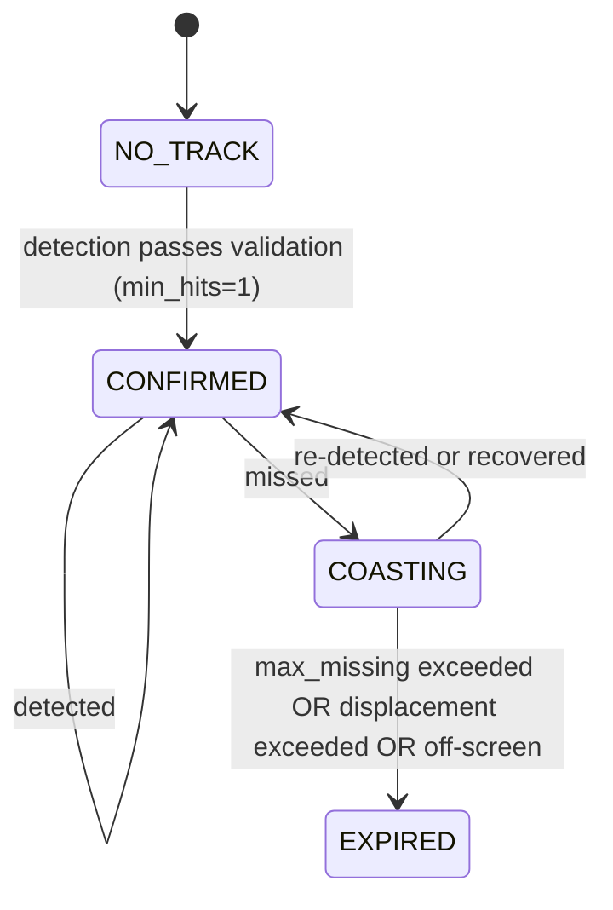
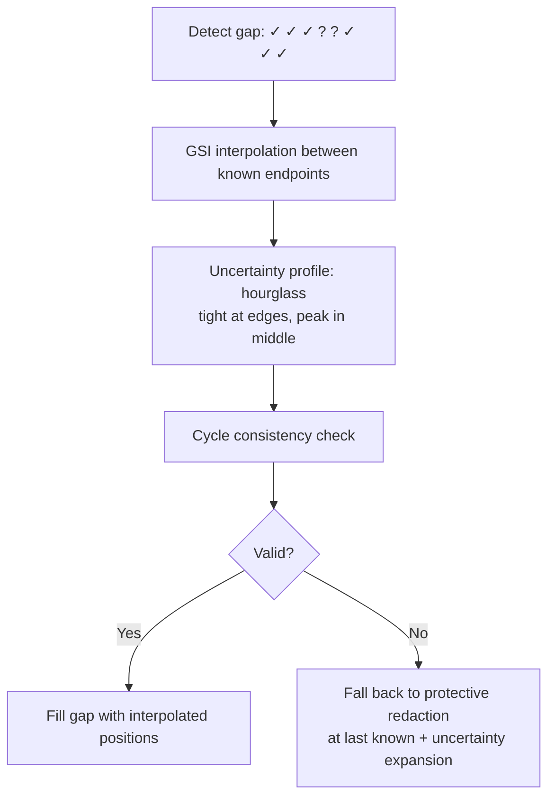
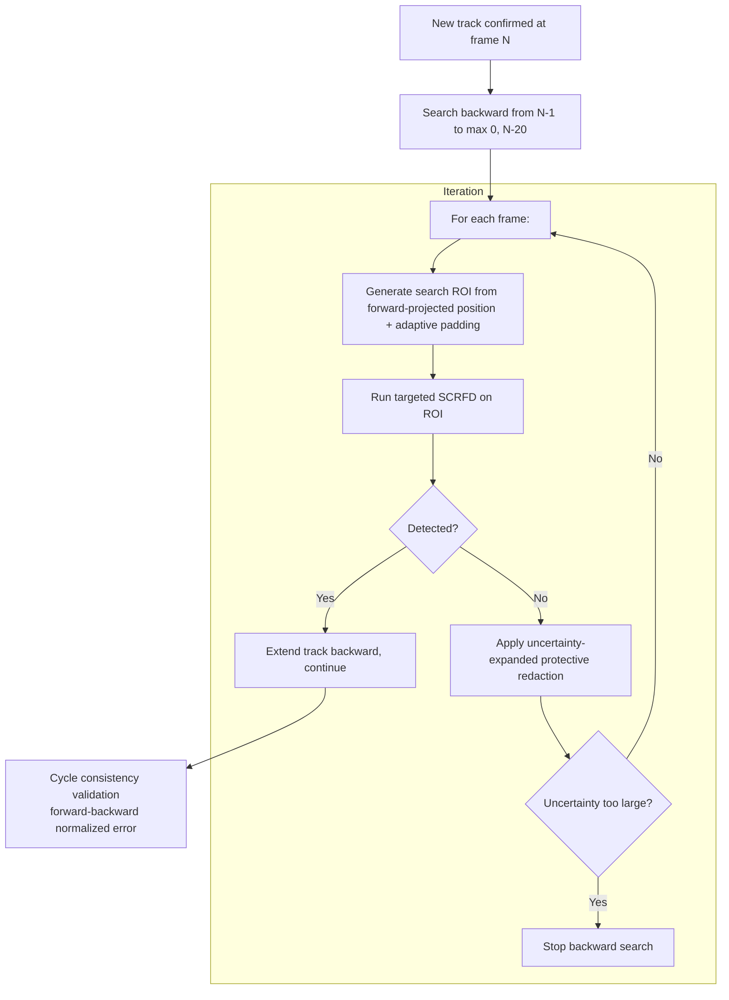
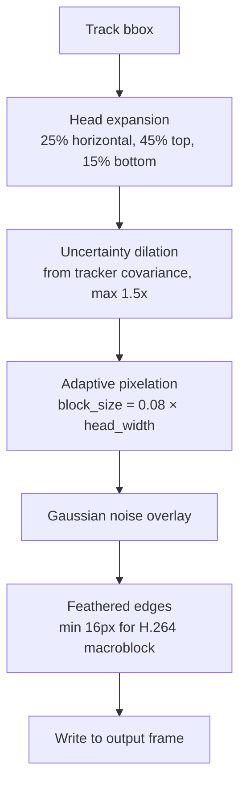
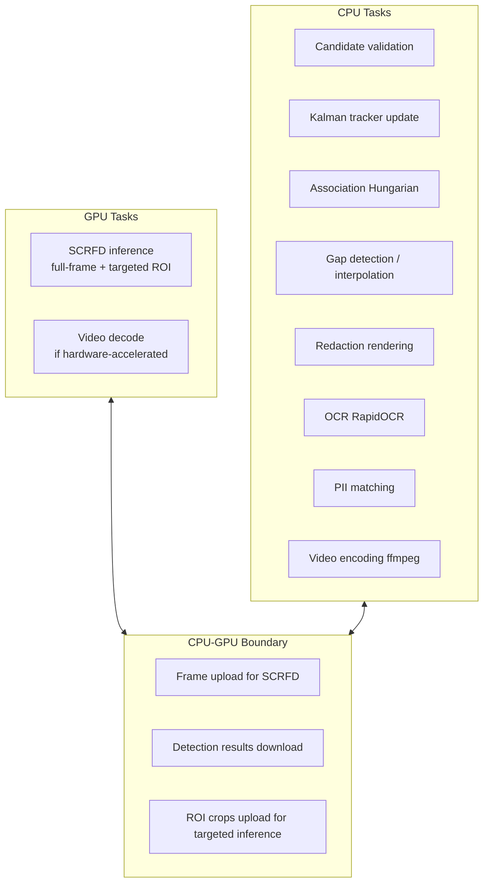
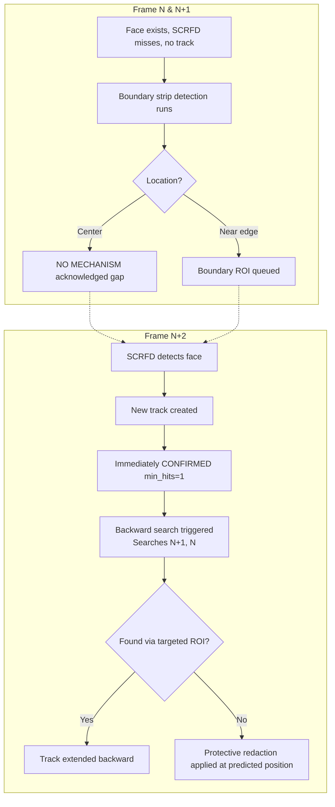

# PixelVeil Architecture Diagrams

This document contains the visual architecture of the PixelVeil pipeline, outlining the dual-pass processing, recovery mechanisms, and privacy safety layer.

## 1. High-Level Architecture
The three-pass pipeline strictly separating forward tracking, offline recovery, and redaction rendering.

**WHY IT EXISTS:** Segregates real-time forward tracking from computationally intensive targeted recovery, ensuring efficiency while maintaining high recall.
**COMPUTATIONAL COST:** GPU constrained for inference, memory constrained during offline recovery phase (buffering tracks).

## 2. Detailed Face Detection Pipeline (Per-Frame)
The logic executed for every single frame during the forward pass.

**INPUT:** Raw video frame.
**DECISION:** Does this detection or track behavior warrant secondary scrutiny?
**OUTPUT:** Validated full-frame detections and queues for ROI targeting.

## 3. Suspicious Frame Detection & Routing
Criteria for routing regions to the targeted recovery pipeline.

**WHY IT EXISTS:** SCRFD failures are predictable (edges, rapid scaling, occlusions). Identifying these triggers targeted intervention.

## 4. Targeted ROI Recovery
The selective inference pipeline for suspicious regions.

**RESEARCH EVIDENCE:** Running inference on crops effectively increases resolution, recovering small faces that full-frame (640x640) downsizing obscures. (Validation: A)

## 5. Tracking State Machine
Track lifecycle handling immediate confirmation for strict privacy. The `TENTATIVE` state is bypassed/removed entirely since `min_hits=1`.

**DECISION:** `min_hits=1` is chosen because missing a face for even one frame violates the core privacy mandate, favoring false positives over false negatives. The state machine is thus simplified.

## 6. Mid-Track Gap Recovery (Offline)
Interpolation and validation of missed detections between known track states.

**FAILURE MODE:** Non-linear movement during the gap. Mitigated by uncertainty expansion and cycle consistency.

## 7. Track-Start Recovery (Offline)
Backward searching to catch faces before they were confidently detected.

## 8. Privacy/Redaction Pipeline
Final output generation with guaranteed occlusion.

**PARAMETERS:**
- Head expansion: H (25%), T (45%), B (15%) [Validation: C]
- Max dilation: 1.5x [Validation: D]
- Macroblock edge feathering: 16px [Validation: B]

## 9. Compute Architecture (GTX 1650)
Hardware utilization split between GPU and CPU.

## 10. Brand-New Face Problem Flow
Edge case handling for delayed detection of a new face.

**FAILURE MODE:** Central face appearing suddenly (e.g. turning around) missed for 1-2 frames before detection. Mitigated by backward search applying protective redaction at predicted position.
