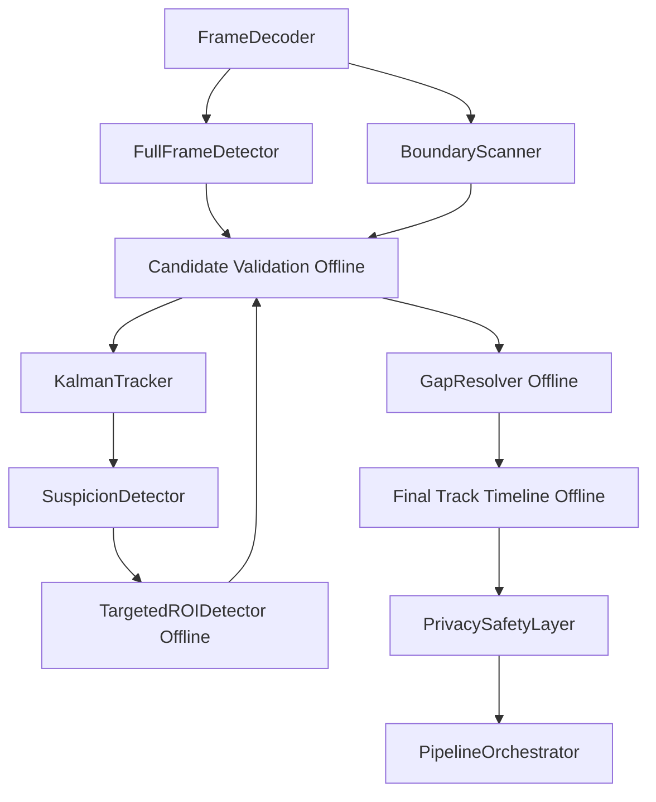

# PixelVeil Architecture Specification

This document details the component specification for the new PixelVeil architecture. It defines the purpose, inputs, outputs, state, algorithmic logic, and parameters for each component in the system.

## Architectural Overview



---

## 1. FrameDecoder

- **Purpose**: Decode video frames sequentially for processing.
- **Inputs**: Video file path or stream URL.
- **Outputs**: BGR frame (H×W×3 numpy array).
- **State**: Current frame index, video properties (FPS, dimensions).
- **Algorithm**:
  ```python
  def decode_frame(video_source):
      # Currently uses cv2.VideoCapture (synchronous)
      # Read single frame at a time
      success, frame = cap.read()
      return frame
  ```
- **Conditions**: Frame must be successfully read.
- **Failure behavior**: If frame read fails, attempt retry or signal End of Stream (EOS).
- **Parameters**: None specific to decoding.
- **Dependencies**: OpenCV (cv2.VideoCapture) or ffmpeg pipe.
- **Computational cost**: ~2-5ms per frame (1080p).
- **Why It Exists**: Fundamental prerequisite for video processing.
- **Research Evidence**: Currently standard synchronous decoding. Target: Explore ffmpeg pipe for decode if bottlenecked.

---

## 2. FullFrameDetector (SCRFD-0.5GF / 500M)

- **Purpose**: Detect faces in the full frame.
- **Inputs**: BGR frame (H×W×3 numpy array).
- **Outputs**: List of `(x, y, w, h, confidence)` detections.
- **State**: ONNX session state.
- **Algorithm**:
  ```python
  def detect(frame):
      blob = preprocess(frame, target_size=(640, 640))
      outputs = onnx_session.run(blob)
      detections = decode_outputs(outputs, score_thresh=0.5, nms_thresh=0.4)
      return detections
  ```
- **Conditions**: Frame dimensions > 0.
- **Failure behavior**: If ONNX session fails, fall back to CPU. If both fail, skip frame and log error.
- **Parameters**:
  - `input_size`: (640, 640) [A: PixelVeil-validated]
  - `confidence_threshold`: 0.5 [A: PixelVeil-validated]
  - `nms_threshold`: 0.4 [A: PixelVeil-validated]
  - `model`: `det_500m.onnx` [A: PixelVeil-validated, but requires benchmarking larger variants like 2.5GF/10GF for hard-face recall]
- **Dependencies**: ONNX Runtime (CUDA/CPU).
- **Computational cost**: ~15ms CUDA, ~34ms CPU [A: PixelVeil benchmarked for 0.5GF].
- **Why It Exists**: Primary detection mechanism for identifying faces.
- **Research Evidence**: Phase 1 — SCRFD-0.5GF achieves 68.5% WIDER FACE Hard AP. Larger variants (e.g. 10GF) achieve >83% and must be benchmarked against PixelVeil's corpus.

---

## 3. BoundaryScanner

- **Purpose**: Detect faces entering from frame edges that full-frame detection might miss due to partial visibility or scale.
- **Inputs**: BGR frame, frame dimensions.
- **Outputs**: List of `(x, y, w, h, confidence)` detections from boundary strips.
- **State**: None (Stateless).
- **Algorithm**:
  ```python
  # Implementation is an experimental policy. Must benchmark:
  # 1. 4 strips (all edges)
  # 2. 2 horizontal strips (top/bottom)
  # 3. 2 vertical strips (left/right)
  # 4. Alternating strips per frame
  # 5. Sampled boundary scans
  
  strip_width = max(64, int(frame_width * 0.10))  # [Experiment: tunable]

  boundary_rois = get_boundary_policy_rois(frame, policy_type)

  boundary_detections = []
  for roi in boundary_rois:
      detections = scrfd.detect(roi, confidence=0.3)  # lower threshold for edges
      map_to_full_frame(detections, roi_offset)
      boundary_detections.extend(detections)
      
  merge_with_full_frame(boundary_detections, fullframe_detections, nms_thresh=0.4)
  ```
- **Conditions**: Policy dictates frequency and coverage.
- **Failure behavior**: If boundary scanning exceeds compute budget, reduce strips or frequency.
- **Parameters**:
  - `strip_width`: max(64, 10% of frame dimension) [Experiment: tunable]
  - `confidence_threshold`: 0.3 [Experiment: tunable]
  - `policy_type`: e.g. "4_strips", "alternating" [Experiment: tunable]
- **Dependencies**: SCRFD detector.
- **Computational cost**: To be benchmarked. 4 full SCRFD inferences on crops can cost up to 4 x 15ms = 60ms.
- **Why It Exists**: One recovery mechanism for the brand-new face problem (faces entering from edges). 
- **Research Evidence**: Phase 1 — zero-padding boundary artifacts cause edge detection failures. Strip width and frequency remain unvalidated hypotheses.

---

## 4. CandidateValidator

- **Purpose**: Filter false positive detections without destroying recall on small/partial faces (privacy-biased).
- **Inputs**: Detection `(x, y, w, h, confidence)`, optional tracker state.
- **Outputs**: Validation state (e.g. VALID, UNCERTAIN, INVALID).
- **State**: None (Stateless).
- **Algorithm**:
  ```python
  # Stage 1: Geometric assessment [O(1)]
  IF aspect_ratio < 0.5 OR aspect_ratio > 2.0: 
      RETURN INVALID  # completely impossible shape

  IF width < 20 OR height < 20: 
      # Detector reliability is poor, but could be a real face!
      mark_as_uncertain_for_targeted_roi(detection)
      RETURN UNCERTAIN

  # Stage 2: Motion plausibility (only if matching existing track)
  IF has_matching_track:
      mahalanobis_dist = compute_mahalanobis(detection, track.predicted_state, track.covariance)
      IF mahalanobis_dist > 9.48: RETURN INVALID  # chi-squared 95%, 4 DOF

  RETURN VALID  # Privacy-biased: accept by default
  ```
- **Conditions**: Always runs on new detections.
- **Failure behavior**: If valid faces are rejected, adjust heuristics.
- **Parameters**:
  - `uncertainty_size_threshold`: 20x20 [Experiment: tunable]
  - `aspect_ratio_range`: 0.5-2.0 [B: Literature]
  - `mahalanobis_threshold`: 9.48 [B: Literature, chi-squared 95% 4 DOF]
- **Dependencies**: None.
- **Computational cost**: O(1) per candidate, negligible.
- **Why It Exists**: Categorizes noise vs. real faces without assuming small faces are false positives. 
- **Research Evidence**: Detection degrades strongly below ~32 px, meaning these require secondary evidence (e.g., Targeted ROI), not outright rejection.

---

## 5. KalmanTracker

- **Purpose**: Maintain temporal identity and spatial predictions across frames.
- **Inputs**: List of validated detections per frame.
- **Outputs**: List of active tracks with state, bbox, covariance.
- **State**: Track states: CONFIRMED, COASTING, EXPIRED. (NO_TRACK implicitly handled; min_hits=1 removes TENTATIVE). 
  - Track vector: `[cx, cy, w, h, vx, vy, vw, vh]` (8-dimensional). Covariance matrix `P`.
  - Evidence provenance: Each observation has a source (e.g. FULL_FRAME, BOUNDARY, TARGETED_ROI, INTERPOLATED, PREDICTED).
- **Algorithm**:
  ```python
  # Canonical Association Algorithm:
  # Linear Kalman prediction + Mahalanobis gating + IoU cost + Hungarian assignment
  
  FOR each track:
      track.predict()  # Kalman predict step: x = F*x, P = F*P*F' + Q

  # Two-stage association (optional split for low-confidence)
  high_conf = [d for d in detections if d.conf >= 0.5]
  low_conf = [d for d in detections if d.conf < 0.5 and d.conf >= 0.15]

  # Stage 1: Associate high-confidence with all tracks
  cost_matrix = compute_costs(tracks, high_conf)  # IoU + Mahalanobis
  matched_1, unmatched_tracks_1, unmatched_dets_1 = hungarian(cost_matrix)

  # Stage 2: Associate low-confidence with remaining unmatched tracks
  cost_matrix_2 = compute_costs(unmatched_tracks_1, low_conf)  # IoU only
  matched_2, unmatched_tracks_2, unmatched_dets_2 = hungarian(cost_matrix_2)

  FOR matched tracks: kalman_update(track, detection, source='FULL_FRAME')
  FOR unmatched tracks: track.state = COASTING, increment missing_frames
  FOR unmatched detections: create_new_track(detection, state=CONFIRMED)  # min_hits=1

  # Expiration
  FOR coasting tracks:
      IF missing_frames > max_missing (30): EXPIRE
      IF total_displacement > max_displacement: EXPIRE  
      IF off_screen: EXPIRE
  ```
- **Conditions**: Runs every frame.
- **Failure behavior**: If Kalman diverges, reset to detection measurement.
- **Parameters**:
  - `Process noise Q`: diagonal, tunable [C: Reasonable starting value]
  - `Measurement noise R`: diagonal, tunable [C: Reasonable starting value]
  - `max_missing_frames`: 30 [B: Literature]
  - `max_total_coast_displacement`: 200px [A: PixelVeil-validated]
  - `high_confidence_threshold`: 0.5 [A: PixelVeil-validated]
  - `low_confidence_threshold`: 0.15 [C: Reasonable starting value]
  - `min_hits_to_confirm`: 1 [B: Literature, privacy-biased]
- **Dependencies**: Hungarian algorithm (scipy.optimize.linear_sum_assignment).
- **Computational cost**: O(N^3) for Hungarian on N tracks, ~1ms for typical scenes (<10 faces).
- **Why It Exists**: Correlates detections over time, predicts positions during occlusions, provides uncertainty estimates.
- **Research Evidence**: Phase 4 — ByteTrack/OC-SORT recommended. Kalman provides covariance for uncertainty. No ReID needed.

---

## 6. SuspicionDetector

- **Purpose**: Identify frames/regions that need targeted recovery (gaps or missing track starts).
- **Inputs**: Track states, detection results, frame context.
- **Outputs**: List of suspicious regions with reason codes.
- **State**: Tracks state history.
- **Algorithm**:
  ```python
  suspicious_regions = []

  FOR each track:
      IF track.state == COASTING:
          # Track just lost detection
          suspicious_regions.append({
              'type': 'COASTING_TRACK',
              'bbox': track.predicted_bbox,
              'uncertainty': track.covariance,
              'frame': current_frame
          })
      
      IF track.was_just_confirmed AND track.first_frame > 0:
          # New track - trigger backward search
          suspicious_regions.append({
              'type': 'TRACK_START',
              'bbox': track.bbox_at_confirmation,
              'search_depth': min(20, track.first_frame),
              'frame': track.first_frame
          })

  # Boundary suspicion is handled by BoundaryScanner, not here

  return suspicious_regions
  ```
- **Conditions**: Evaluated per track per frame.
- **Failure behavior**: If too many suspicious regions, prioritize by recency.
- **Parameters**: None explicitly defined here (uses tracker params).
- **Dependencies**: Tracker state.
- **Computational cost**: O(N) per frame where N = number of tracks, negligible.
- **Why It Exists**: Directs expensive computational resources (Targeted ROI, Offline Recovery) only where needed.
- **Research Evidence**: Phase 5/6 — offline recovery needs suspicion signals.

---

## 7. TargetedROIDetector

- **Purpose**: Run SCRFD at higher effective resolution on specific suspicious regions to recover missed detections.
- **Inputs**: Frame, ROI coordinates, confidence adjustment.
- **Outputs**: Detections within ROI, mapped to full-frame coordinates.
- **State**: Stateless.
- **Algorithm**:
  ```python
  # Generate ROI with overlap margin
  roi_bbox = expand_bbox(suspicious_region.bbox, margin=0.15)  # 15% overlap
  roi_crop = frame[roi_bbox.y1:roi_bbox.y2, roi_bbox.x1:roi_bbox.x2]

  # SCRFD processes this crop at 640x640 - much higher effective resolution
  roi_detections = scrfd.detect(roi_crop, confidence=0.35)  # adjusted threshold

  # Map back to full-frame coordinates
  for det in roi_detections:
      det.x += roi_bbox.x1
      det.y += roi_bbox.y1

  # NMS merge with existing detections
  merged = nms_merge(fullframe_detections, roi_detections, threshold=0.4)
  ```
- **Conditions**: Triggered by SuspicionDetector or GapResolver.
- **Failure behavior**: If ROI inference is too expensive, batch or skip low-priority regions.
- **Parameters**:
  - `roi_margin`: 0.15 (15% overlap) [C: Reasonable starting value, Phase 2 suggests 10-20%]
  - `roi_confidence`: 0.35 [C: Reasonable starting value, lower than full-frame due to confidence inflation]
- **Dependencies**: SCRFD detector.
- **Computational cost**: ~15ms CUDA per ROI [A: PixelVeil-benchmarked, same as full-frame SCRFD].
- **Why It Exists**: Extracts smaller faces by processing crops at higher relative resolution.
- **Research Evidence**: Phase 2 — tiling preserves pixel density. Confidence inflates on crops. Phase 7 — ROI feasible on GTX 1650 for offline.

---

## 8. GapResolver (Offline)

- **Purpose**: Fill mid-track gaps and track-start gaps using future evidence (Pass 2).
- **Inputs**: Complete track timeline from Pass 1.
- **Outputs**: Filled track timeline with interpolated/recovered positions.
- **State**: Full track history across the video.
- **Algorithm**:

  **Case A: Mid-Track Gap (✓ ✓ ✓ ? ? ✓ ✓ ✓)**
  ```python
  FOR each gap in track:
      start_bbox = last_confirmed_before_gap
      end_bbox = first_confirmed_after_gap
      gap_length = end_frame - start_frame
      
      IF gap_length <= 5:  # Short gap
          # GSI interpolation
          interpolated = gaussian_smoothed_interpolation(start_bbox, end_bbox, gap_length)
          
          # Cycle consistency check
          forward = predict_forward(start_bbox, gap_length)
          backward = predict_backward(end_bbox, gap_length)
          
          normalized_cycle_error = distance(forward, backward) / face_diagonal(start_bbox)
          
          IF normalized_cycle_error < cycle_consistency_threshold:  # [Experiment: tunable]
              fill_gap(interpolated, uncertainty='hourglass', source='INTERPOLATED')
          ELSE:
              # Fall back to protective redaction
              fill_gap_with_protection(start_bbox, expansion_factor=1.3)
      ELSE IF gap_length <= 15:  # Medium gap
          # Run targeted SCRFD on gap frames
          FOR frame in gap_frames:
              roi = predict_position(track, frame)
              detections = targeted_scrfd(frame, roi)
              IF detections: update_gap(detections)
              ELSE: interpolate_remaining()
      ELSE:  # Long gap (>15 frames)
          # Too long to reliably interpolate
          terminate_old_track()
          # New track will be created when face re-detected
  ```

  **Case B: Track-Start Gap (? ? ? ✓ ✓ ✓)**
  ```python
  FOR each track with first_frame > 0:
      search_start = track.first_confirmed_frame
      max_backward = min(max_backward_search, search_start)  # [Experiment: tunable]
      
      FOR frame_offset in range(1, max_backward + 1):
          target_frame = search_start - frame_offset
          
          # Project position backward
          predicted_bbox = backward_project(track, frame_offset)
          search_roi = expand_with_uncertainty(predicted_bbox, frame_offset)
          
          # Check uncertainty hasn't grown too large
          IF search_roi.area > uncertainty_expansion_cap * track.bbox.area:  # [Experiment: tunable]
              BREAK  # Uncertainty too large, stop searching
          
          detections = targeted_scrfd(frames[target_frame], search_roi)
          
          IF detections:
              # Validate with cycle consistency
              normalized_cycle_error = forward_backward_check_normalized(detections, track)
              IF normalized_cycle_error <= cycle_consistency_threshold:  # [Experiment: tunable]
                  extend_track_backward(track, detections, target_frame, source='BACKWARD_RECOVERY')
              ELSE:
                  # Detection found but inconsistent - provisional protection
                  apply_protective_redaction(predicted_bbox, target_frame)
                  BREAK
          ELSE:
              # No detection found - visibility/uncertainty test
              IF is_plausible_face_region(predicted_bbox):
                  apply_protective_redaction(predicted_bbox, target_frame)
              ELSE:
                  BREAK  # Stop recovery, drifting into background
  ```

- **Conditions**: Runs entirely offline after Pass 1 completes.
- **Failure behavior**: If recovery fails, apply protective redaction. If too expensive, limit backward depth.
- **Parameters**:
  - `max_backward_search`: 20 frames [Experiment: tunable based on frame rate and compute budget]
  - `cycle_consistency_threshold`: Normalized error metric (e.g. error / face_diagonal) [Experiment: tunable]
  - `max_interpolation_gap`: 15 frames [Experiment: tunable]
  - `uncertainty_expansion_cap`: 1.5x [Experiment: tunable]
- **Dependencies**: TargetedROIDetector, Tracker history.
- **Computational cost**: GSI interpolation: ~7ms [B: Literature]. Backward SCRFD: ~15ms per frame per track.
- **Why It Exists**: Fixes missed detections retroactively, completely eliminating small gaps and catching late-detected faces.
- **Research Evidence**: Phase 5 — GSI superior to simple linear interpolation for nonlinear trajectories. Phase 6 — Backward tracking is viable, but frame ceilings and exact cycle thresholds must be empirically determined for PixelVeil.

---

## 9. PrivacySafetyLayer

- **Purpose**: Apply privacy-safe redaction with uncertainty-aware expansion.
- **Inputs**: Track with bbox, covariance, state.
- **Outputs**: Expanded redaction region, redaction parameters.
- **State**: Stateless (depends on track state).
- **Algorithm**:
  ```python
  # Base expansion (head coverage)
  expanded = expand_for_head(track.bbox)
      # horizontal: +25% each side
      # vertical: +45% above, +15% below

  # Uncertainty-aware dilation
  IF track.state == CONFIRMED:
      uncertainty_expansion = 0  # tight fit
  ELSE IF track.state == COASTING:
      # Map 2D measurement covariance to a confidence region, then to an axis-aligned expansion
      confidence_ellipse = get_confidence_ellipse(track.P, confidence_level=0.95)
      axis_aligned_expansion = bounding_box_of_ellipse(confidence_ellipse)
      uncertainty_expansion = axis_aligned_expansion.margin
      uncertainty_expansion = min(uncertainty_expansion, max_expansion_ratio * max(expanded.w, expanded.h))
  ELSE IF track.state == INTERPOLATED:
      # Hourglass uncertainty from gap position
      uncertainty_expansion = gap_uncertainty_at_position(track.gap_info)

  final_region = expand_bbox(expanded, uncertainty_expansion)

  # Adaptive redaction strength
  face_width = track.bbox[2]
  block_size = max(4, int(0.08 * face_width))  # [B: Literature]
  noise_sigma = 10  # [Experiment: tunable]
  feather_width = max(16, int(0.15 * face_width))  # [Experiment: tunable, heuristic for macroblock leakage]

  return final_region, block_size, noise_sigma, feather_width
  ```
- **Conditions**: Applied before rendering to output.
- **Failure behavior**: If expansion is too aggressive (covering too much background), tune confidence level or cap.
- **Parameters**:
  - `confidence_level`: 0.95 [Experiment: tunable, maps covariance to uncertainty region]
  - `max_expansion_ratio`: 1.5x [Experiment: tunable]
  - `base_pixelation_scalar`: 0.08 * W_head [B: Literature]
  - `noise_sigma`: 10 [Experiment: tunable hypothesis for disruption]
  - `min_feather`: 16px [Experiment: tunable]
  - `head_expansion`: {horizontal: 25%, top: 45%, bottom: 15%} [A: PixelVeil-validated, current values]
- **Dependencies**: Mask generation, OpenCV rendering.
- **Computational cost**: O(1) per track, negligible.
- **Why It Exists**: Ensures robust privacy protection even when precise location is uncertain, while mitigating H.264 compression leakage.
- **Research Evidence**: Phase 8 — adaptive pixelation is literature-supported. Noise overlay and 16px feathering are hypotheses/heuristics needing benchmark validation against reconstruction and leakage.

---

## 10. PipelineOrchestrator

- **Purpose**: Coordinate all components across three passes.
- **Inputs**: Video source.
- **Outputs**: Redacted video.
- **State**: Orchestrates entire pipeline state.
- **Algorithm**:
  ```python
  # PASS 1: Forward detection and tracking
  FOR each frame in video:
      detections = full_frame_scrfd(frame)
      boundary_dets = boundary_scanner(frame)
      all_dets = merge(detections, boundary_dets)
      validated_dets = candidate_validator(all_dets)
      tracks = kalman_tracker.update(validated_dets, frame_shape)
      suspicion_detector.analyze(tracks, frame_index)
      
      # OCR (sampled)
      IF frame_index % ocr_sample_rate == 0:
          ocr_results = ocr_detector(frame)
          pii_matches = pii_matcher(ocr_results)
      
      # Store frame data for Pass 2
      frame_data[frame_index] = {
          'tracks': tracks,
          'suspicions': suspicion_detector.get_suspicious()
      }

  # PASS 2: Offline recovery (operates on stored track data)
  FOR each track in all_tracks:
      # Step 1: Detect gaps
      gaps = gap_resolver.detect_gaps(track)
      
      # Step 2: Targeted re-observation
      FOR each gap in gaps:
          roi_dets = targeted_roi_scrfd(gap.frames, gap.roi)
          
          # Step 3: Recovered detections
          IF roi_dets: 
              update_track_with_observations(track, roi_dets)
              
      # Step 4: Remaining unresolved gap
      remaining_gaps = gap_resolver.detect_gaps(track)
      
      # Step 5 & 6: GSI and provisional protection
      FOR each gap in remaining_gaps:
          gsi_success = gap_resolver.apply_gsi(track, gap)
          IF NOT gsi_success:
              apply_provisional_protection(track, gap)

  # PASS 3: Redaction (renders final output)
  FOR each frame in video:
      frame = decode(frame)
      FOR each active_track at this frame:
          region, params = privacy_safety_layer(track)
          apply_redaction(frame, region, params)
      FOR each pii_match at this frame:
          apply_pii_redaction(frame, pii_match)
      FOR each zone:
          apply_zone_redaction(frame, zone)
      encode(frame)
  ```
- **Conditions**: Drives the system.
- **Failure behavior**: Propagates errors or handles fallback for graceful degradation.
- **Parameters**: Pass structure.
- **Dependencies**: All other components.
- **Computational cost**: Pass 1 dominates (~20-30ms per frame). Pass 2 is proportional to suspicious regions. Pass 3 is ~5-10ms per frame.
- **Why It Exists**: Orchestrates complex multi-pass offline architecture.
- **Note**: For simplicity, Passes 1 and 3 can be merged (process frame, redact, encode) with Pass 2 as a post-processing step. But this requires keeping all frames in memory or re-reading the video.

---

## CRITICAL ARCHITECTURAL NOTES

### Brand-New Face Problem (P0)
**The fundamental challenge**: How can the system know frames N and N+1 are suspicious if there was no track?

**Solution**: TWO mechanisms working together:
1. **Boundary Scanner** (proactive): Checks frame edges every frame. Catches faces entering from edges.
2. **Backward Recovery** (reactive): When a face IS finally detected at frame N+2, backward search covers N+1 and N.

**ACKNOWLEDGED GAP**: If a face appears in the CENTER of the frame (not from an edge) and SCRFD misses it for multiple frames, there is NO proactive mechanism. The face will only be detected when SCRFD finally picks it up, at which point backward recovery activates. This is a fundamental limitation of single-detector architecture.

**Mitigation**: The backward recovery (max 20 frames) provides temporal coverage. For most real-world scenarios, faces enter from edges (covered by boundary scanner) or are detected within a few frames (covered by backward recovery).

### Why Not Add a Second Detector?
Phase 1 research shows different detectors have different failure modes. However:
- YuNet is currently broken (ISSUE-010).
- Running two detectors doubles inference cost.
- Selective ROI + boundary scanning addresses the main failure modes more efficiently.
- If a face is truly invisible to SCRFD (e.g., extreme angle), a second lightweight detector is unlikely to help either.
