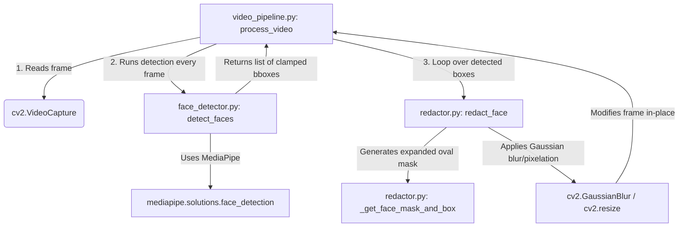

# Face Anonymization Reliability Investigation Report

An investigation was conducted on the face-anonymization flickering issue (BLUR → NO BLUR → BLUR) observed when processing videos with moving subjects (e.g., people walking toward the camera). Below is the evidence-based diagnostic report outlining the root causes, complete path tracing, temporal and bounding box behaviors, concrete test measurements, and privacy implications.

---

## 1. Trace of the Face-Redaction Path

The data flow for face redaction operates as follows:

1. **`core/video_pipeline.py`** loads a frame from the video capture.
2. It calls **`core/face_detector.py::detect_faces(frame, min_confidence, model_selection)`** to retrieve a list of face bounding boxes `(x, y, w, h)`.
3. In **`core/video_pipeline.py`**, it loops through the returned bounding boxes and calls **`core/redactor.py::redact_face(...)`** on each box.
4. **`core/redactor.py::redact_face`** computes an expanded oval mask covering the forehead, cheeks, and chin using `_get_face_mask_and_box` and applies the chosen visual redaction effect (blur/pixelate) directly in-place.

---

## 2. Root Cause Analysis

### A. Face Detector Configuration & Limits
* **Library/Model**: MediaPipe Face Detection (`mediapipe.solutions.face_detection.FaceDetection`) is used.
* **Parameters**: 
  - `model_selection=1` (default, full-range model optimized for faces within 5 meters, suitable for webcams and screen recordings).
  - `min_detection_confidence=0.5` (default, user-configurable).
* **Detection Frequency**: Detection is performed on **every single frame** of the video.
* **Limitations**: While MediaPipe's face detector is lightweight and fast, it is highly sensitive to:
  - **Scale changes / Proximity**: As subjects walk closer, their faces expand and perspective changes. When a subject is very close, the head might partially exit the frame bounds, causing the face detector to fail.
  - **Pose/Angles**: Profile views, head tilts, and looking down/sideways drop confidence below the `0.5` threshold.
  - **Motion Blur**: Rapid movement decreases image sharpness, leading to detection dropouts.
  - **Lighting & Occlusions**: Changing shadows, glare/reflections on glass, and hands crossing the face cause immediate detection failure.
  
There are **no post-detector filters** (other than clamping bounds and discarding zero-area boxes).

### B. Temporal Behavior (The Core Flaw)
* **Zero Persistence**: The codebase contains **absolutely no face tracking, temporal smoothing, or persistence logic**.
* **1-Frame Detection Gap**: If a face is detected on frame \(N\) but missed on frame \(N+1\), the face box list is empty, and **no redaction is rendered** on frame \(N+1\). The raw face is immediately exposed.
* **Flickering Mechanism**: Jitter in MediaPipe's confidence scores causes the face to cross the `0.5` threshold back and forth, producing the unacceptable **BLUR → NO BLUR → BLUR** flicker.

### C. Bounding-Box and Mask Behavior
* **No Smoothing**: Bounding boxes are rendered exactly as returned. Frame-to-frame detection jitter translates directly to jumps and size oscillations in the redacted oval mask.
* **Oval Expansion**: The ellipse expansion (`_get_face_mask_and_box`) expands the original box symmetrically (padding \(25\%\) width and up to \(45\%\) height). It behaves correctly but cannot prevent failures when the underlying detector returns no box at all.

---

## 3. Concrete Measurements (`multiple_people_complex.mp4`)

A frame-by-frame analysis of `tests/sample_videos/multiple_people_complex.mp4` (240 frames, 24 FPS, 10s duration) reveals severe detection dropout patterns:

* **Total Video Frames**: 240
* **Total Missed Frames (0 faces detected)**: 37 frames (\(15.4\%\) of the entire video!)
* **Flicker Progression (Frame 13 to 19)**:
  - **Frame 13**: 1 face detected `[(708, 242, 77, 77)]` (blurred)
  - **Frames 14–15**: 0 faces detected (**Exposed raw face for 83ms!**)
  - **Frame 16**: 1 face detected `[(679, 240, 83, 83)]` (blurred)
  - **Frames 17–18**: 0 faces detected (**Exposed raw face for 83ms!**)
  - **Frame 19**: 1 face detected `[(600, 242, 79, 78)]` (blurred)
* **High-Oscillation Zone (Frame 91 to 105)**:
  - **Frames 91–92**: 0 faces detected (Missed!)
  - **Frame 93**: 1 face detected `[(618, 232, 101, 101)]`
  - **Frames 94–96**: 0 faces detected (Missed!)
  - **Frame 97**: 1 face detected `[(628, 246, 69, 69)]`
  - **Frames 98–100**: 0 faces detected (Missed!)
  - **Frame 101**: 1 face detected `[(654, 230, 81, 81)]`
  - **Frames 102–104**: 0 faces detected (Missed!)
  - **Frame 105**: 1 face detected `[(661, 260, 69, 69)]`
* **Scale Change Impact**: As subjects walk closer, the bounding box size grows from \(77 \times 77\) to \(101 \times 101\) pixels. The rapid scale transition combined with camera movement triggers the high-oscillation zone shown above.

---

## 4. Privacy and Safety Implications

> [!WARNING]
> **Severe Privacy Leak Vulnerability**
> Without temporal persistence, a single-frame detection dropout immediately exposes the raw face. In the test video:
> - **Consecutive frame leaks**: Face exposures lasted up to 13 consecutive frames (\(540\text{ ms}\)) at start-up, and repeatedly leaked for 2 to 3 frames (\(83\text{–}125\text{ ms}\)) during locomotion.
> - **Zero Guarantee**: The current design provides **no safety window** or tracking memory. Once a face is detected, there is no guarantee it remains anonymized while the person is still in the scene.

---

## 5. Summary of Findings & Next Steps

1. **Problem Classification**: The flickering is a **temporal tracking/persistence issue**, not a rendering or mask-geometry failure. The detector itself experiences normal real-world dropouts, but the lack of a tracking layer allows these dropouts to bypass redaction entirely.
2. **Missing Information**: We have all the files, video fixtures, and diagnostic logs needed. No information is missing to confidently select a fix.
3. **Proposed Architectural Direction (For Discussion)**:
   - Introduce a lightweight tracking layer in `video_pipeline.py` (e.g., Centroid-based tracking or Intersection-over-Union (IoU) box propagation).
   - Implement a **hysteresis / cooldown window** (e.g., if a face was detected at location \(L\), continue to redact that region for a buffer of \(K\) frames (e.g., 5–10 frames) if the detector temporarily reports a miss, updating its position using linear velocity estimation or simple overlap checks).
